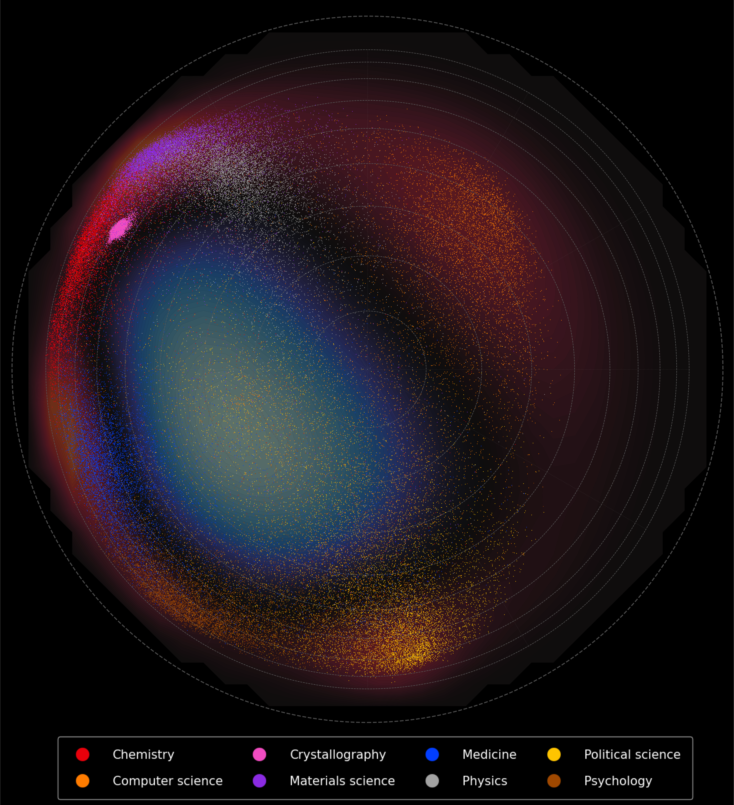
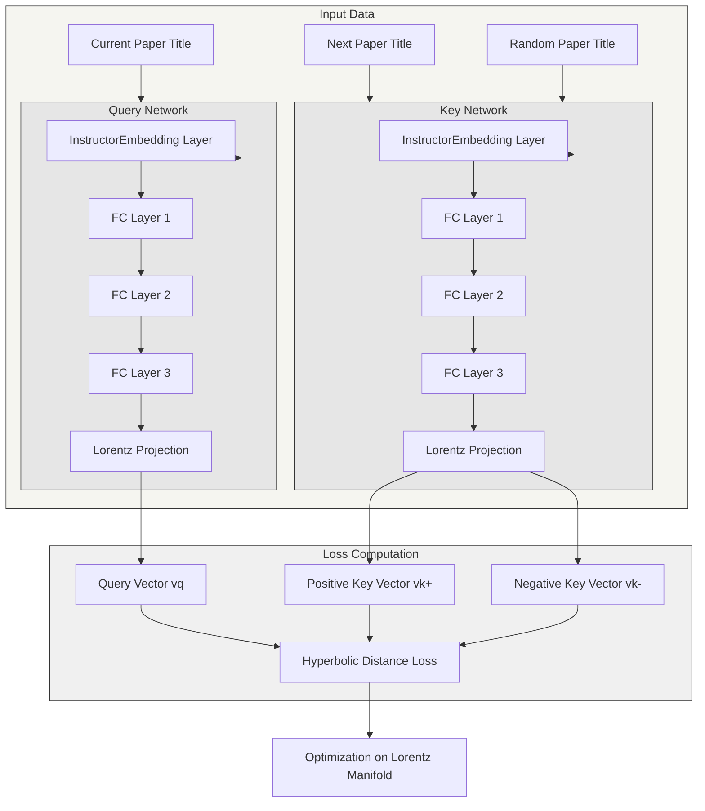

# Art Competition 2025 at Binghamton University



This is a repository for art "Gravity of Ideas: Mapping Science at BU" submitted to the Binghamton University Art Competition 2025.

The caption of the artwork is as follows:

> This hyperbolic map visualizes 1.1 million papers by 14,490 BU researchers, tracking topic shifts over time. Distance reflects specialization—outward points represent niche research. Blue and red regions show fields researchers leave and enter, respectively. The map highlights increasing specialization among BU researchers and the shifting dynamics of scientific focus.

## Overview

I was interested in visualizing the research landscape of resrearchers at Binghamton University. My starting point was the list of authors who affiliated with Binghamton University at least once in their career. I then retrieve the papers by these authors from the OpenAlex API. The result is a dataset of 1.1 million papers and 14,490 authors.

The map is generated by training a Lorentz embedding model of the papers. The model consists of two parallel neural networks, i.e., a query network and a key network. Each network starts with a fixed [InstructorEmbedding](https://instructor-embedding.github.io/) layer that converts paper titles into initial embeddings. These embeddings then flow through trainable neural networks consisting of three fully-connected layers with decreasing dimensions, followed by a final projection onto the Lorentz manifold (hyperboloid).

For each paper in an author's publication timeline:
- The current paper is passed through the query network, which outputs a query embedding, $v_q$
- Their next paper is passed through the key network as a positive example, which outputs a key embedding, $v_k ^+$
- A random paper is passed through the key network as a negative example, which outputs a key embedding, $v_k ^-$
- The loss encourages the positive pair ($v_q, v_k ^+$) to be closer in hyperbolic space than the negative pair ($v_q, v_k ^-$)




The hyperbolic geometry is handled by the geoopt package, which provides Riemannian optimization on the Lorentz manifold. This allows the model to learn hierarchical relationships between papers in a space that naturally expands outward.

This model essentially learns the following transition probabilities:

$$
P(v_k ^+ | v_q) \propto P(v_k ^+) \exp(-d_L(v_q,v_k ^+))
$$

where $d_L$ is the Lorentzian distance on the hyperboloid, and $P(v_k ^+)$ is the probability that a randomly sampled paper is $v_k ^+$, which is proportional to the number of authors of this paper. Based on this, we can compute a `potential` analagous to the gravity potential in physics:

$$
\begin{aligned}
\phi_{\text{out}}(x) &= -\sum_{v_k ^+} P(v_k^+) \exp(-d_L(x,v_k^+)) \\
\phi_{\text{in}}(x) &= -\sum_{v_q} P(v_q) \exp(-d_L(v_q, x))
\end{aligned}
$$

where $x$ is a point in the hyperbolic space. The `in-potential` $\phi_{\text{in}}(x)$ represents the sum of the probabilities of all papers in the space. The gradient of the in-potential encodes the direction of the net flow of papers towards $x$.

$$
\nabla \phi_{\text{in}}(x) = \sum_{v_q} P(v_q) \exp(-d_L(v_q, x)) \nabla d_L(v_q, x)
$$

Similarly for the out-potential. We then compute the difference between the in-potential and the out-potential to get the net flow of authors towards $x$.

$$
\phi(x) = \phi_{\text{in}}(x) - \phi_{\text{out}}(x)
$$

The map shows this net flow of authors towards $x$, with the blue region being the area of high out-flow and the red region being the area of high in-flow.


## Install

```bash
mamba create -n buart2025 -c bioconda -c nvidia -c pytorch -c pyg -c conda-forge python=3.11 cuda-version=12.4 pytorch torchvision torchaudio pytorch-cuda=12.4 snakemake scikit-learn numpy numba scipy pandas polars networkx seaborn matplotlib gensim ipykernel tqdm black faiss-gpu pyg python-igraph gputil snakefmt huggingface_hub=0.16.4 sentence-transformers=2.2.2 InstructorEmbedding=1.0.1 geoopt and sqlalchemy -y
```

Configure the config.yaml file with the institution ID.

```bash
# set the directories below and copy this file as `config.yaml`
data_dir: "./data/" # set the data directory
institution_id: "https://openalex.org/I123946342" # set the institution ID.
```

## Run

```bash
snakemake --cores 4 all
```

## Visualize

```bash
python notebooks/visualize-lorenz-embedding/main.py
```
